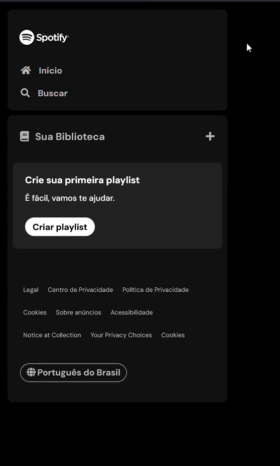
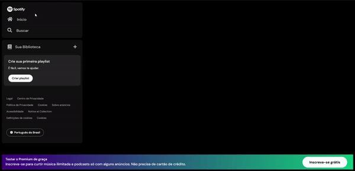

# Spotifake - Imersão Alura

Projeto que recria a página do Spotify, desenvolvido durante a primeira Imersão Fornt-end da Alura (01/2024).

> 🚧 Status: *em desenvolvimento* 🚧

| :placard: Vitrine.Dev |     |
| -------------  | --- |
| :sparkles: Nome        | **Spotifake**
| :label: Tecnologias | HTML, CSS, JavaScript
| :rocket: URL         | 
| :fire: Desafio     | Imersão Front-end Alura 2024

<!-- Inserir imagem com a #vitrinedev ao final do link -->
<!--  -->

## Detalhes do projeto

### Dia 1

- Revisão HTML e CSS
- Construir o menu lateral *(sidebar navegation)*
- Desafio:
  - Criar a aba "Sua Biblioteca".

**Resultado do dia 1**  

### Dia 2
- CSS
  - Flexbox
  - Pseudo-classes
- Finalizar menu lateral
- Desafio:
  - Fazer o rodapé *(footer)*

**Resultado do dia 2**

### Dia 3
- Melhorar estrutura do projeto
- Refatorar o código
  - Usar váriaveis CSS
- Criar o menu superior *(header)*
- Desafio:
  - Construir a seção principal da página com os cards de “Boa tarde” e “Navegar por todas as seções”

**Resultado do dia 3**
