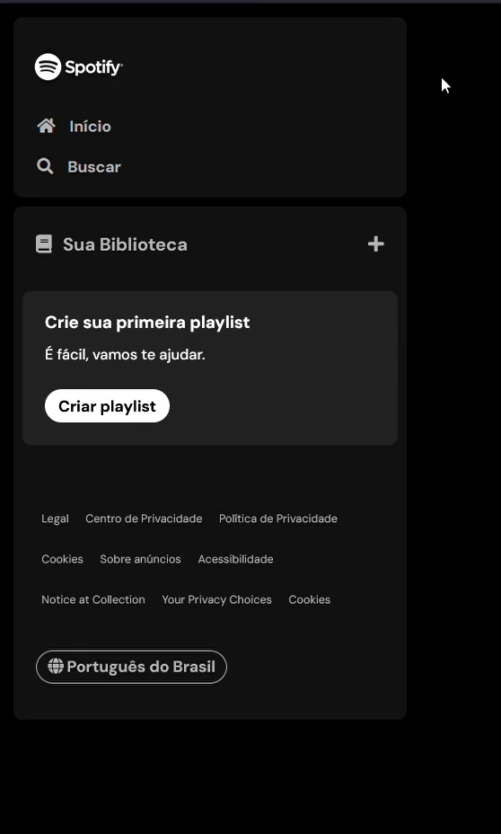
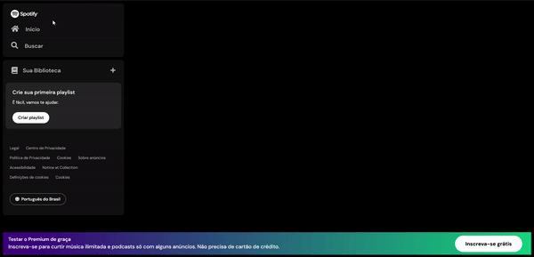
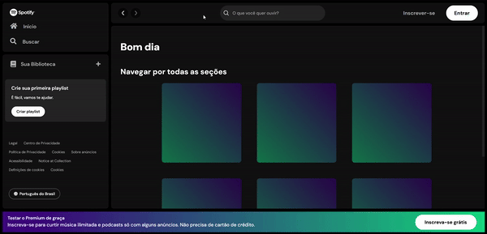
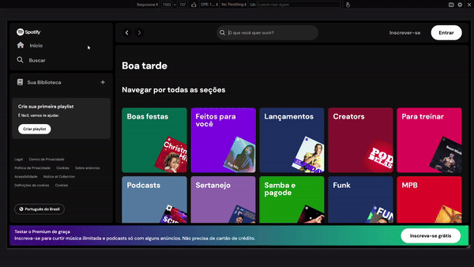

# Spotifake - Imersão Alura

Projeto desenvolvido durante a primeira Imersão Front-end da Alura (01/2024), que recria a página do Spotify (resolvi chamar este clone do Spotify de Spotifake). 

> 🏁 Status: *concluído* 

| :placard: Vitrine.Dev |     |
| -------------  | --- |
| :sparkles: Nome        | **Spotifake**
| :label: Tecnologias | HTML, CSS, SASS, JavaScript, React
| :rocket: URL         | 
| :fire: Desafio     | Imersão Front-end Alura 2024
  

## Detalhes do projeto

Nos 4 primeiros dias o Spotify Clone foi desenvolvido utilizando HTML, CSS e Javascript. No 5º dia da Imersão foi iniciado uma nova versão do projeto usando React, sendo este o primeiro projeto que fiz com react e que estilizei com o pré-processador SCSS.

### Dia 1

- Revisão HTML e CSS
- Construir o menu lateral *(sidebar navegation)*
- Desafio:
  - Criar a aba "Sua Biblioteca".

**Resultado do dia 1**  

### Dia 2
- CSS
  - Flexbox
  - Pseudo-classes
- Finalizar menu lateral
- Desafio:
  - Fazer o rodapé *(footer)*

**Resultado do dia 2**  

### Dia 3
- Melhorar estrutura do projeto
- Refatorar o código
  - Usar váriaveis CSS
- Criar o menu superior *(header)*
- Desafio:
  - Construir a seção principal da página com os cards de “Boa tarde” e “Navegar por todas as seções”

**Resultado do dia 3**  

### Dia 4
- Adicionar os cards da página inicial
- Utilizar media queries para responsividade
- Introduzir o JavaScript no projeto
  - Método Promises
- Adicionar arquivo `.json` com dados para simular uma api com o `json.server`, para testar o campo de busca.
- Desafios:
  - Teste fazer mais cards se baseie na página do Spotify e aprenda muito mais;
  - ~~Crie um arquivo API JSON diferente e explore mais.~~  Ao invés de fazer esse desafio, preferi ajustar o layout e a responsividade.

**Resultado do dia 4**  

### Dia 5  
- Dar introdução a um projeto React;
- Utilizar o framework React para criar o componente `<Header>`;
- Desafios:
  - Fazer o resto do React.
  - *Desafio pessoal:* utilizar SCSS para estilizar a página.
  
**Resultado do dia 5**  

  
### Referências

- [Documentação React - create element](https://react.dev/reference/react/createElement)

- [W3Schools](https://www.w3schools.com/)

- [Passing Data from Child to Parent Components in React](https://medium.com/@ozhanli/passing-data-from-child-to-parent-components-in-react-e347ea60b1bb)

- [How to pass data from one component to other component in ReactJS?](https://www.geeksforgeeks.org/how-to-pass-data-from-one-component-to-other-component-in-reactjs/)

- Cursos Alura - *SASS: CSS sinteticamente espetacular* e *SASS e CSS: estilizando um site*.